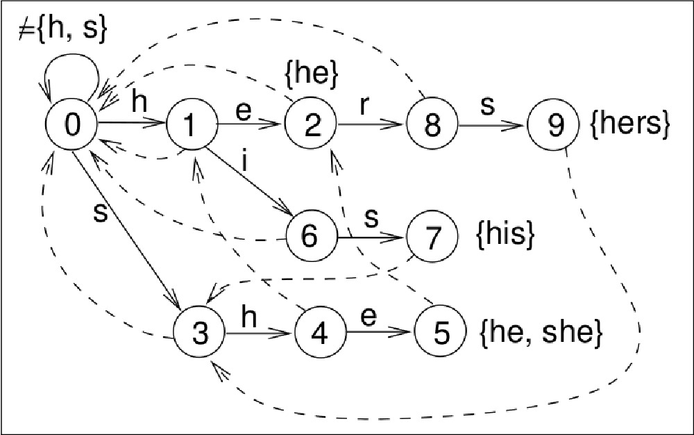
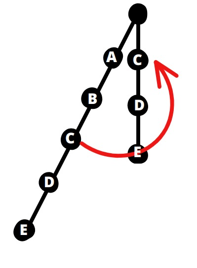
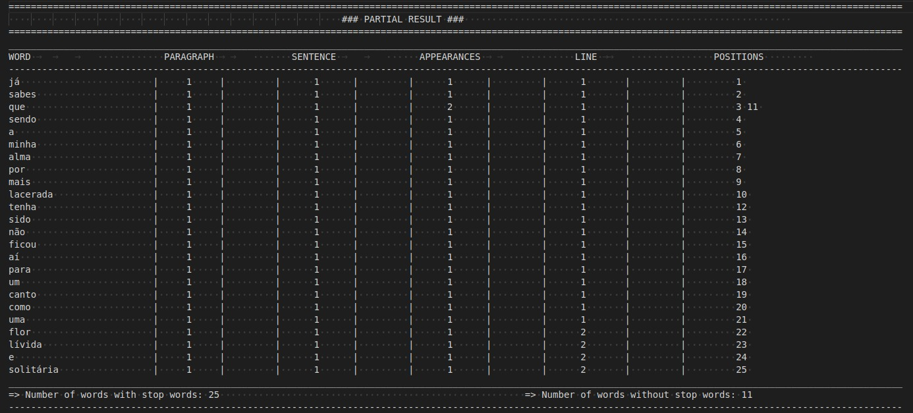
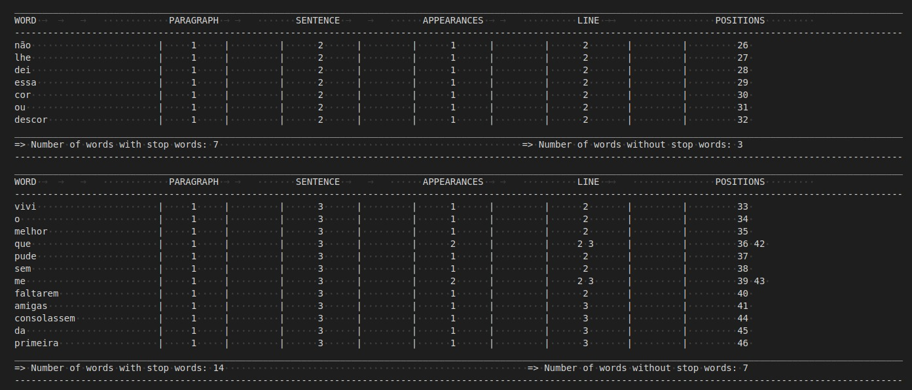
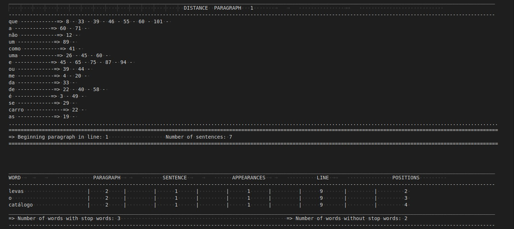
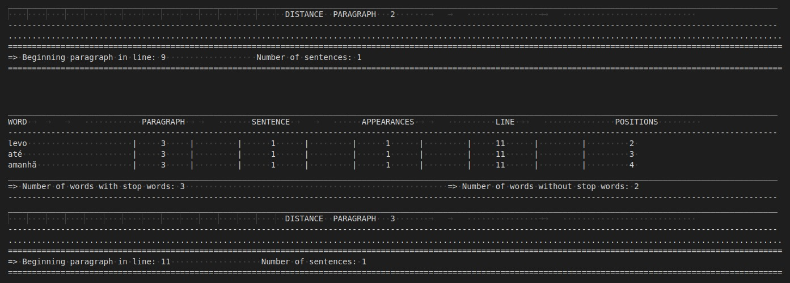
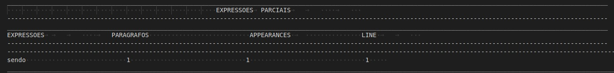
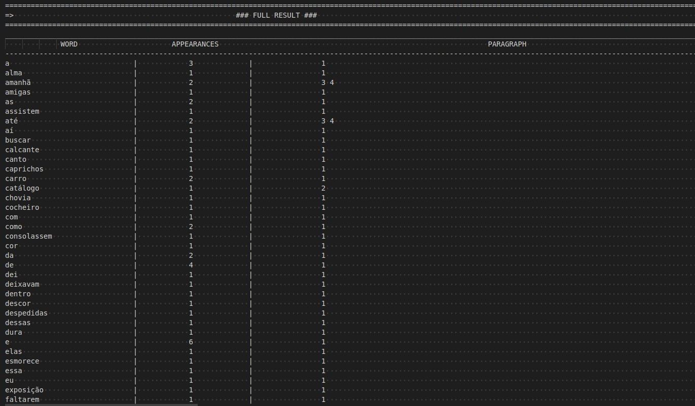
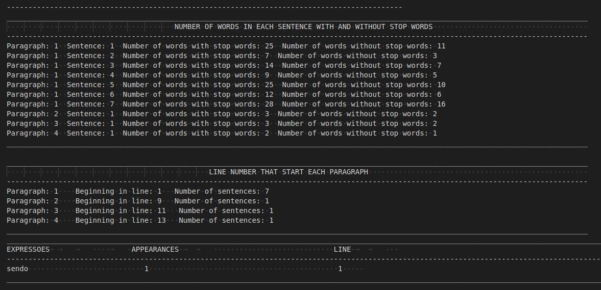
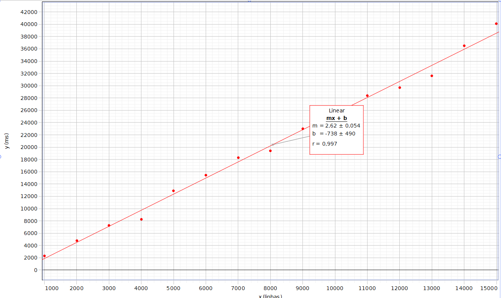

<h1 align="center" font-size="200em"><b>O Auxiliar de Redação</b></h1>

<div align = "center" >
<!-- imagem -->

[](https://code.visualstudio.com/docs/?dv=linux64_deb)


</div>

## 📌Sumário
- [Introdução](#Introdução)
- [Objetivos](#Objetivos)
- [Arquivos](#Arquivos)
- [Resolução do Problema](#Resolução-do-problema)
- [Funções](#Funções)
- [Resultados](#Resultados)
- [Conclusão](#Conclusão)
- [Referências](#Referências)
- [Compilação e execução](#Compilação-e-execução)
- [Contato](#Contato)

## ✒️Introdução
<p align="justify">
Este é um programa desenvolvido em C++ para a disciplina de Algoritmos e Estruturas de Dados I. 
Levando em consideração que a publicação dos resultados de pesquisa é um estágio essencial no trabalho científico. Normalmente, esses resultados são compartilhados por meio de artigos em conferências e revistas científicas, após passarem por uma revisão rigorosa de forma e conteúdo. Infelizmente, é comum encontrar artigos acadêmicos que apresentam dificuldades de leitura, além de conter erros de ortografia e gramática. Partindo desse problema desenvolveu-se este algoritmo.
</p>

## 💻Objetivos

O objetivo deste trabalho consiste em especificar, projetar e implementar um sistema que facilite o processo de redação. Para alcançar esse objetivo, é fundamental realizar um cuidadoso projeto das estruturas de dados e dos algoritmos correspondentes, com o intuito de garantir a eficiência do sistema na prática.

<strong><h4>Condições impostas: </h4></strong>
- A princípio este código reealiza a leitura de um arquivo de entrada intitulado ```entrada.txt```, o qual contém o texto a ser analisado.
- As sentenças são definidas pelos sinais de pontuação (".", "?", "!").
- Cada parágrafo é separado por uma linha em branco.
- Existe um arquivo de ```stop words``` para análise. Sendo as stop words artigos e conjunções que podem ser alteradas de acordo com a preferência do usuário.
- Existe um arquivo de ```expressoes``` para análise. Sendo essas expressões formadas por uma ou mais palavras, que podem ser alteradas de acordo com a preferência do usuário.
- A saída vai fornecer os dados após a análise do arquivo de entrada.


## 📄Arquivos
- <strong>Main.cpp:</strong> Leitura dos arquivos ```entrada.txt```, ```stopwords.txt``` e ```expressoes.txt```,  tempo de execução do código e é realizada a chamada das funções necessários para o funcionamento.
- <strong>models.hpp:</strong> Declaração das structs ```WordInfo```, ```Sentenca```, ```ParagraphInfo```, ```Expression```.
- <strong>functions.hpp:</strong> Declaração das funções.
- <strong>header.cpp:</strong> Inclusão das bibliotecas e arquivos utilizados.
- <strong>functions.cpp:</strong> Desenvolvimento das funções. 
- <strong>aho.hpp:</strong> Implementação da estrutura Aho Corasick.
- <strong>Output.txt:</strong> A saída do programa.
- <strong>data/entrada.txt:</strong> Texto de entrada.
- <strong>data/stopwords.txt:</strong> Stop words, como por exemplo, para artigo (a, o, as,os) e para conjunções (e, ou).
- <strong>data/expressoes.txt:</strong> Expressões, como por exemplo, (uma vez que, sendo assim).

## 🔨Resolução do problema

Visando encontrar uma solução eficiente e rápida para resolução do problema, foram usadas as seguintes estruturas de dados:

<h3><b>Aho Corasick</b></h3>

Aho-Corasick que é uma técnica poderosa usada para a busca eficiente de múltiplos padrões em um texto. Ela combina os conceitos de uma árvore TRIE e autômatos de estado finito para realizar essa tarefa de forma otimizada.

A árvore TRIE (também conhecida como árvore de prefixos) é uma estrutura de dados especializada para armazenar e buscar palavras ou sequências de caracteres. Ela possui uma estrutura hierárquica, na qual cada nó representa um caractere e as arestas representam a transição entre os caracteres. Essa estrutura é ideal para a busca de padrões, pois permite uma correspondência rápida e eficiente.

<div align="center">
  
  <p align="center"><em> Exemplificação da Aho Corasick </em></p>
</div>


No Aho-Corasick, os autômatos de estado finito são utilizados para otimizar a busca por múltiplos padrões. Eles permitem a transição entre os estados de forma eficiente, reduzindo a necessidade de comparar todos os padrões em cada posição do texto pois permite a busca de múltiplos padrões simultaneamente.

A Aho possui complexidade de busca linear em relação ao tamanho da string de entrada mais o tamanho total de todos os padrões buscados e tem como complexidade de tempo: O(n + l + z), onde 'n' é o comprimento do texto, 'l' é o comprimento das palavras-chave e 'z' é o número de correspondências. O custo do seu espaço auxiliar é O(l * q), onde ‘q’ é o comprimento do alfabeto, pois é o número máximo de filhos que um nó pode ter.
Essa estrutura explora as similaridades entre os padrões para reduzir a quantidade de dados necessários para representá-los e consegue mantém um bom desempenho mesmo quando há padrões muito longos e ainda se houver padrões que se sobrepõem parcial ou completamente, ambos serão encontrados.

<h3><b>Map</b></h3>

A estrutura map mantém os elementos ordenados com base nas chaves, o que é útil quando é para iterar pelos elementos em uma ordem específica, possui uma complexidade de O(log n), onde n é o número de elementos no mapa. Isso ocorre porque os elementos são organizados em uma árvore binária balanceada, o que permite uma busca rápida.

<h3><b>Unodered map</b></h3>

O  unordered map armazena os elementos em uma tabela de hash, permitindo inserção e busca muito rápidas, com complexidade média de O(1). Isso é especialmente vantajoso quando a velocidade de acesso é uma consideração importante. Ao contrário do map, o unordered map não mantém uma ordem específica nos elementos. 

<h3><b>Tabela Hash</b></h3>

A estrutura de tabela hash permite uma busca eficiente em média, com complexidade de tempo médio O(1). Isso ocorre porque ela usa uma função de hash para calcular o índice de armazenamento de cada elemento, permitindo um acesso direto aos dados, sem a necessidade de percorrer todos os elementos. Além disso, as tabelas hash utilizam uma quantidade de espaço razoável para armazenar os elementos e garantir um bom desempenho. A alocação de espaço é feita com base no número esperado de elementos e a capacidade é automaticamente ajustada conforme necessário, evitando desperdício de memória.


## 🔨 Funções 

<h3><b>Parâmetros gerais do texto e stop words</b></h3>

- ```addStopWord:``` Durante a leitura do arquivo que contém as stop words, elas são adicionadas em um ```unordered_map```. Caso ela já esteja nesse unordered map, incrementa-se em 1 o seu número de ocorrências e salva-se a linha em que ela está, usando a função ```existentWordUnorderedMap```.

- ```returnWord:``` Analisa cada caracter do arquivo de entrada, concatenando-o em uma palavra até que um caracter especial, como espaço, vírgula ou dois pontos apareça, que indicará o final daquela palavra. No caso em que o caracter for um espaço ou ```\n```, o contador da posição da palavra naquele parágrafo é incrementado em um. Também no caso do caracter ser um ```\n```, incrementa-se 1 à variável ```n``` que indica o número da linha do arquivo atual. A cada palavra finalizada, chama-se a função ```updateWord```. Sempre é verificado se o parágrafo acabou, através da chamada da função ``` updateParagrafo```.

- ```updateWord:``` Nessa função, será analisado se a palavra atual, não sendo vazia, já foi lida, verificando o map de palavras. Caso positivo, incrementa-se em 1 o seu número de ocorrências e adiciona-se em seu vector de referências a linha atual, através da função ```existentWord```, insere-se a palavra no vector de sentenças daquele parágrafo, usando a função ```addVectorPalavraNaSentenca```, atualiza a ```tabelaHashPosicoes``` com a nova posição da palavra, além de chamar a função ```addVectorParagrafo``` para inserir a palavra no vector de palavras daquele parágrafo que não contém palavras repetidas. A ```tabelaHashPosicoes``` é utilizada para acessar, de maneira rápida, a posição da palavra no parágrafo atual, sendo a chave da hash a própria string e o conteúdo armazenado um vector de pair, que guarda o índice do parágrafo e a posição da palavra dentro dele. 
Caso a palavra ainda não tenha sido lida anteriormente no texto, ela será adicionada ao map, será inserida no vector de sentenças, a ```tabelaHashPosicoes``` será atualizada e a linha atual será salva nas referências. Caso a palavra esteja contida no unordered map de stop words, o contador de stop words é incrementado em 1. A palavra é reinicializada como vazia, para a leitura da próxima. 

- ```addVectorPalavraNaSentenca:``` Verifica-se se a palavra atual já foi adicionada anteriormente ao vector de palavras da sentença com repetição, com a função ```verificar```. Caso negativo, a palavra é inserida tanto no vector de palavras da sentença com repetição quanto sem repetição, caso contrário, a palavra será inserida apenas no vector com repetição. Em ambos os casos, é utilizado a função ```existePalavraNaSentenca```, que percorre o vector de palavras na sentença sem repetição para encontrar o índice da palavra atual, e atualizar o vector que contem as posições com a posição atual.

- ```addVectorParagrafo:``` Verifica-se se a palavra atual já foi adicionada anteriormente ao vector de palavras do parágrafo sem repetição, com a função ```verificar2```. Caso positivo, o seu número de ocorrências é incrementado, e são atualizados os vectors que contém as linhas das aparições e as posições, com a função ```existePalavraNoParagrafo```. Caso negativo, adiciona-se a palabra no vector de palavras do parágrafo sem repetição.

- ```updateSentenca:``` No caso em que o caracter é '!', '.' ou '?', tem-se que a sentença acabou. Nesses casos, o objeto da sentença atual é salvo na struct do seu parágrafo correspondente. 

- ```updateParagrafo: ```No fim de cada concatenação da palavra na função ```returnWord```, verifica-se se o parágrafo foi encerrado. Se o caracter atual for vazio e o anterior for um ```'\n'``` é porque há uma linha vazia, logo o parágrafo foi encerrado. Salva-se a linha final do parágrafo anterior e a linha inicial do próximo parágrafo. As manipulações dos objetos são feitas na função ```alocarParagrafo```.

- ```alocarParagrafo:``` São salvos na struct do parágrafo que foi finalizado: o número de sentenças, o vector de objetos que contém as sentenças propriamente ditas e o vector de objeto de sentenças sem repetição de palavras. Os contadores são reinicializados, vectors têm sua memória liberada, os dados do parágrafo lido são impressos no output e seu objeto é salvo no vector de parágrafos e é deletado.

<h3><b>Expressões</b></h3>

- ```add_string:``` Adiciona uma nova expressão à árvore de busca Trie. Ela recebe uma ```string s``` como entrada e percorre a árvore Trie, adicionando novos vértices conforme necessário para representar a string. Começando pelo vértice raiz, percorremos a string s caractere por caractere.
Para cada caractere, verificamos se há um filho correspondente no vértice atual. Se não houver, criamos um novo vértice e o adicionamos como filho do vértice atual.
Em seguida, atualizamos o vértice atual para o novo vértice criado e repetimos o processo para o próximo caractere.
Após percorrer toda a string s, marcamos o último vértice como folha (indicando que uma expressão termina nesse ponto) e atribuímos um ID único à expressão. 

- ```prepare:``` Pré-processamento da árvore Trie para calcular os links de sufixo e os links de palavra final. Ela percorre a árvore em largura, calculando os links de sufixo para cada vértice, o que permite uma busca eficiente na árvore. Começando pelo vértice raiz, usamos uma fila para percorrer a árvore em largura. Para cada vértice na fila, calculamos o link de sufixo, que é o caminho a seguir quando não há correspondência com o caractere atual. Se o vértice atual é o vértice raiz ou tem como pai o vértice raiz, definimos o link de sufixo como o próprio vértice raiz. Caso contrário, seguimos o link de sufixo do pai até encontrar um vértice com um filho correspondente ao caractere do vértice atual. Esse será o link de sufixo do vértice atual. Além disso, atualizamos o link de palavra final, que aponta para o vértice mais próximo que representa o sufixo da expressão atual. Repetimos esse processo até percorrer toda a árvore em largura. 

- ```process:``` Realiza a busca de padrões na string de texto fornecida. Ela percorre a string de texto caractere por caractere, seguindo os links da árvore Trie. Sempre que um padrão é encontrado, é incrementado um contador e os índices e números de linha correspondentes são armazenados em vetores. Para cada caractere na string de texto, seguimos o link correspondente do vértice atual na árvore Trie. Se não há um link correspondente, voltamos ao vértice raiz e continuamos a busca. Quando encontramos um vértice folha, significa que uma expressão foi encontrada. Incrementamos um contador de ocorrências e armazenamos o índice inicial da ocorrência na string de texto e o número de linha correspondente. Repetimos esse processo para cada caractere na string de texto. 

- ```add_expressions:``` Lê um arquivo de texto contendo uma expressão por linha e adiciona a expressão correspondente à árvore Trie usando a função ```add_string```. 


- ```process_text_file:``` Lê um arquivo de texto completo e realiza o processamento da árvore Trie nesse texto. Ela primeiro lê o conteúdo do arquivo e, em seguida, chama a função process para buscar as ocorrências das expressões na árvore Trie. Em seguida, exibe as ocorrências encontradas chamando a função print_matches. Abre o arquivo especificado pelo nome de arquivo fornecido. Lê o conteúdo completo do arquivo de texto. 


- ```print_matches:```Exibe as ocorrências encontradas durante o processamento da árvore Trie.

- ```CalcSuffLink:``` Após a construção da Trie, o algoritmo calcula os links de sufixo para cada nó. O link de sufixo de um nó aponta para o nó correspondente ao maior sufixo próprio desse nó na Trie. Isso permite que o algoritmo salte rapidamente para um nó correspondente quando não há correspondência com um caractere. Além dos links de sufixo, o algoritmo também calcula os links de palavra final. O link de palavra final de um nó aponta para o nó correspondente ao maior sufixo próprio que é uma palavra completa (um padrão) na Trie. Isso permite identificar rapidamente todas as ocorrências de padrões completos no texto.

<div align="center">
  
  <p align="center"><em> Exemplificação do link </em></p>
</div>

- ```getLineNumber:``` Representa o número da linha correspondente ao índice na string.

<h3><b>Output</b></h3>

- ```iniciar_output:``` Impressão do cabeçalho.

- ```output_CadaParagrafo:``` Imprime as palavras contidas em cada parágrafo, sem repeti-las, chamando a função ```output_CadaSentenca```. Também são impressos o número de palavras do parágrafo com e sem stop words, além da função ```output_DistanciaPalavraParagrafo``` ser chamada para imprimir mais detalhes.

- ```output_CadaSentenca:``` Impressão dos seguintes dados de cada palavra: o parágrafo e a sentença atual, número de ocorrência, linha das aparições e posições. Realiza-se um cálculo, baseado no tamanho de cada palavra e de seus dados, para manter a impressão organizada e centralizada.

- ```output_DistanciaPalavraParagrafo:``` São impressas as distâncias das palavras que aparecem mais de uma vez naquele parágrafo, em relação à primeira aparição. Também mostra-se a linha de início do parágrafo e seu número de sentenças.

- ```output_Full:``` Impresão de todas as palavras do texto, em ordem alfabética, além de todos os parágrafos e linhas que elas aparecem, número total de ocorrências e todas suas posições. É mostrado, além disso, dados gerais do texto, como o número de palavras em cada sentença com e sem stop words, e a linha inicial e número de sentenças de todos os parágrafos.

- ```removerAcento:``` Verifica se a palavra tem acento e retorna seu tamanho, visando evitar possíveis erros de alinhamento no output.

## 🎯Resultados

A saída deve atender os seguintes critérios:

1. Para cada parágrafo do texto:

- O número da linha no arquivo fonte onde o parágrafo inicializa e termina;
- O número de sentenças existentes no parágrafo;
- O número de palavras de cada sentença incluindo e descartando as "stop words";

2. Para cada palavra que não é stop word:
- Cada palavra listada em ordem alfabética com a frequência de sua ocorrência no texto, indicando as linhas do arquivo onde essas surgem.
- Em caso cuja palavra apareça mais de uma vez em um mesmo parágrafo, indicar a sua ocorrência e a distância entre elas incluindo as stop words.

3. Ocorrência de certas expressões sendo que para cada expressão deve ser indicado a linha no arquivo fonte onde aparece. 

<h3><b>Entrada</b></h3>


<h3><b>Resultados parciais</b></h3>







<h3><b>Resultado completo</b></h3>


<h3><b>Dados gerais</b></h3>


<h3><b>Tempo de execução</b></h3>
47.8589 milisegundos

Para analisar o custo assistótico do Auxiliar de Redação implementado neste trabalho, verificar cada função e manipulação seria extremamente trabalhoso e impreciso, portanto definiu-se que a melhor forma de realizar essa análise seria observar a relação entre o número de linhas da entrada e o tempo de execução. Obteve-se como resultado a seguinte tabela:

 | Número de linhas                |  Tempo de execução (ms)    |                     
 | --------------------------------| ---------------------------|
 |  1000                           | 2331.4140                  |
 |  2000                           | 4756.0379                  |
 |  3000                           | 7245.5451                  |
 |  4000                           | 8269.3266                  |
 |  5000                           | 12878.3538                 |
 |  6000                           | 15438.6355                 |
 |  7000                           | 18291.2761                 |
 |  8000                           | 19424.3799                 |
 |  9000                           | 22968.5542                 |
 |  10000                          | 25343.7800                 |
 |  11000                          | 28400.1168                 |
 |  12000                          | 29681.4185                 |
 |  13000                          | 31635.1776                 |
 |  14000                          | 36498.4227                 |
 |  15000                          | 40089.7591                 |

A partir da tabela, gerou-se o gráfico visando observar o comportamento do tempo de execução em função do número de linhas da entrada, sendo possível determinar o custo assintótico do algoritmo:
<div align="center">
  
  <p align="center"><em> Número de linhas x Tempo de execução </em></p>
</div>

## ✔️Conclusão

O projeto Auxiliar de Redação é uma ferramenta útil para auxiliar escritores, pesquisadores e estudantes na revisão e análise de textos.
A utilização de estruturas de dados como árvore, fila, vetores, map, unodered map e tabela hash, permitiu a organização e busca eficiente das informações do texto. Os algoritmos implementados garantiram o processamento correto das sentenças, a contagem adequada das palavras e a identificação das expressões e stop words desejadas.

A partir da observação do gráfico que exprime a relação entre o número de linhas da entrada e o tempo de execusão, vê-se que foi obtido aproximadamente uma reta. Portanto, é possível concluir que o algoritmo de implementação do Auxiliar de Redação possui um custo computacional da classe linear.


## ✔️Referências
- https://www.geeksforgeeks.org/aho-corasick-algorithm-pattern-searching/
- https://www.tutorialspoint.com/aho-corasick-algorithm-for-pattern-searching-in-cplusplus
- https://acervolima.com/algoritmo-aho-corasick-para-pesquisa-de-padroes/
- https://www.youtube.com/watch?v=kKQLjWFf4nE&ab_channel=MarcosAndr%C3%A9SilveiraKutova


## 👾Compilação e execução
* Especificações da máquina em que o código foi rodado:
  * Processador Intel Core i5, 7th Gen;
  * Sistema Operacional Windows 10;
  * Terminal do WSL: Ubuntu 20.04.5;
  * 8GB de RAM.
* | Comando                |  Função                                                                                           |                     
  | -----------------------| ------------------------------------------------------------------------------------------------- |
  |  `make clean`          | Apaga a última compilação realizada contida na pasta build                                        |
  |  `make`                | Executa a compilação do programa utilizando o gcc, e o resultado vai para a pasta build           |
  |  `make run`            | Executa o programa da pasta build após a realização da compilação                                 |

## Contato

<div>
 <br><p align="justify"> Anna Laura Moura Santana</p>
 <a href="https://t.me/annalaurams">
  
 </div>
<a style="color:black" href="mailto:nalauramoura@gmail.com?subject=[GitHub]%20Source%20Dynamic%20Lists">
✉️ <i>nalauramoura@gmail.com</i>
</a>

<div>
 <p align="justify"> Julia Rezende Gomes Rocha</p>
 <a href="https://t.me/juliarezende34">
  
 </div>
<a style="color:black" href="mailto:juliarezende34@gmail.com?subject=[GitHub]%20Source%20Dynamic%20Lists">
✉️ <i>juliarezende34@gmail.com</i>
</a>
 
<div>
 <br><p align="justify"> Jullia Fernandes Felizardo</p>
 <a href="https://t.me/JulliaFernandes">
  
 </div>
<a style="color:black" href="mailto:julliacefet@gmail.com?subject=[GitHub]%20Source%20Dynamic%20Lists">
✉️ <i>julliacefet@gmail.com</i>
</a>

<div>
 <br><p align="justify"> Letícia de Oliveira Silva</p>
 <a href="https://t.me/letolsilva">
  
 </div>
<a style="color:black" href="mailto:letolsilva22@gmail.com?subject=[GitHub]%20Source%20Dynamic%20Lists">
✉️ <i>letolsilva22@gmail.com</i>
</a>

<div>
 <br><p align="justify"> Lucas Lima de Oliveira</p>
 <a href="https://t.me/lucas_lima37">
  
 </div>
<a style="color:black" href="mailto:lucaslimadeoliveira80@gmail.com?subject=[GitHub]%20Source%20Dynamic%20Lists">
✉️ <i>lucaslimadeoliveira80@gmail.com</i>
</a>

<div>
 <br><p align="justify"> Mariana Rodrigues Lamounier Melo</p>
 <a href="https://t.me/MariRodriguess0">
  
 </div>
<a style="color:black" href="mailto:mariana.itapec@gmail.com?subject=[GitHub]%20Source%20Dynamic%20Lists">
✉️ <i>mariana.itapec@gmail.com</i>
</a>

